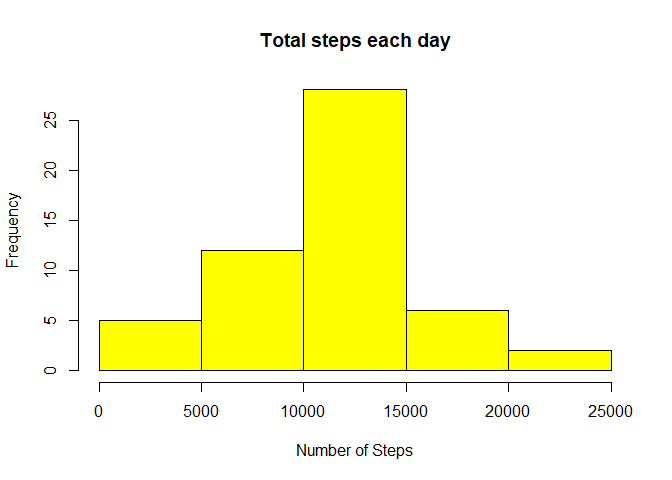
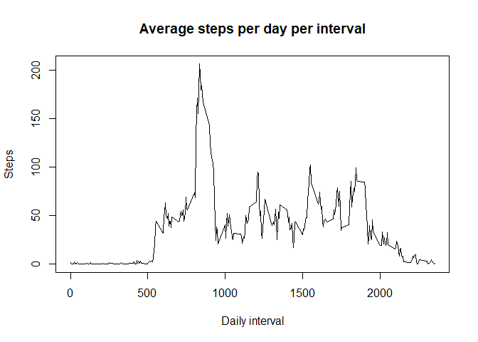
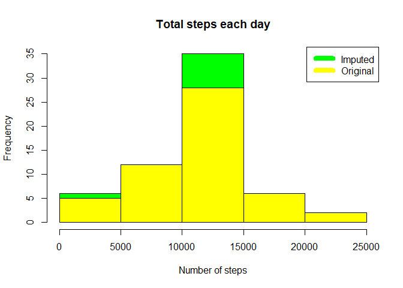
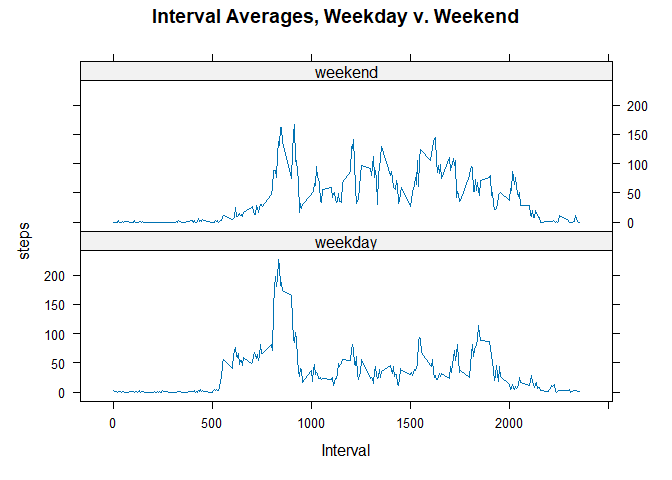

## Introduction
It is now possible to collect a large amount of data about personal movement using activity monitoring devices such as a Fitbit, Nike Fuelband, or Jawbone Up. These type of devices are part of the “quantified self” movement – a group of enthusiasts who take measurements about themselves regularly to improve their health, to find patterns in their behavior, or because they are tech geeks. But these data remain under-utilized both because the raw data are hard to obtain and there is a lack of statistical methods and software for processing and interpreting the data.

This assignment makes use of data from a personal activity monitoring device. This device collects data at 5 minute intervals through out the day. The data consists of two months of data from an anonymous individual collected during the months of October and November, 2012 and include the number of steps taken in 5 minute intervals each day.

The data for this assignment can be downloaded from the course web site:

* Dataset: [Activity monitoring data](https://d396qusza40orc.cloudfront.net/repdata%2Fdata%2Factivity.zip) 

The variables included in this dataset are:

steps: Number of steps taking in a 5-minute interval (missing values are coded as 𝙽𝙰) </br>
date: The date on which the measurement was taken in YYYY-MM-DD format </br>
interval: Identifier for the 5-minute interval in which measurement was taken </br>
The dataset is stored in a comma-separated-value (CSV) file and there are a total of 17,568 observations in this dataset. 

## Loading and preprocessing the data

```r
file.url <- "https://d396qusza40orc.cloudfront.net/repdata%2Fdata%2Factivity.zip"
file.path <- "./activity.zip"

if( !file.exists( "activity.zip" )) {
  download.file( file.url, file.path )
}

if( !file.exists( "activity.csv" )) {
  unzip( file.path )
}

df <- read.csv( "activity.csv" )
df$date <- as.Date( df$date )

summary( df )
```

```
##      steps             date               interval     
##  Min.   :  0.00   Min.   :2012-10-01   Min.   :   0.0  
##  1st Qu.:  0.00   1st Qu.:2012-10-16   1st Qu.: 588.8  
##  Median :  0.00   Median :2012-10-31   Median :1177.5  
##  Mean   : 37.38   Mean   :2012-10-31   Mean   :1177.5  
##  3rd Qu.: 12.00   3rd Qu.:2012-11-15   3rd Qu.:1766.2  
##  Max.   :806.00   Max.   :2012-11-30   Max.   :2355.0  
##  NA's   :2304
```

## What is mean total number of steps taken per day?
To determine this, aggregate all intervals by date and sum the steps and plot. 

```r
totalStepsByDate <- aggregate( steps ~ date, df, sum )

head( totalStepsByDate )
```

```
##         date steps
## 1 2012-10-02   126
## 2 2012-10-03 11352
## 3 2012-10-04 12116
## 4 2012-10-05 13294
## 5 2012-10-06 15420
## 6 2012-10-07 11015
```

```r
hist( totalStepsByDate$steps, main = paste( "Total steps each day" ), col="yellow", xlab = "Number of Steps" )
```

<!-- -->

Also, check the daily mean and median steps across all dates.

```r
dailyMean <- mean( totalStepsByDate$steps )
print( paste( "Daily Mean : ", dailyMean ))
```

```
## [1] "Daily Mean :  10766.1886792453"
```

```r
dailyMedian <- median( totalStepsByDate$steps )
print( paste( "Daily Median : ", dailyMedian ))
```

```
## [1] "Daily Median :  10765"
```


## What is the average daily activity pattern?
To determine this, aggregate the measurements by interval and average the steps; then plot.

```r
stepsByInterval <- aggregate( steps ~ interval, df, mean )
plot( stepsByInterval$interval, stepsByInterval$steps, type = "l", xlab = "Daily interval", 
      ylab = "Steps", main = "Average steps per day per interval" )
```

<!-- -->

Which 5-min interval contains the maximum number of steps

```r
max_interval <- stepsByInterval[ which.max( stepsByInterval$steps ), 1 ]
print( paste( "Max interval : ", max_interval ))
```

```
## [1] "Max interval :  835"
```

## Imputing missing values
To determine the count of missing values, sum the number of records where NOT complete cases

```r
naCount <- sum( !complete.cases( df ))
print( paste( "Total missing values : ", naCount ))
```

```
## [1] "Total missing values :  2304"
```

To impute missing measurements, set a missing day-interval’s value to the average for that same interval across all days. For the first day, which was all NA’s, set all to zero (rather than the method above for each day-1 interval).

```r
imputedData <- transform( df, 
                          steps = ifelse( is.na( df$steps ), 
                                          stepsByInterval$steps[ match( df$interval, stepsByInterval$interval)],                                               df$steps ))
imputedData[ as.character( imputedData$date ) == "2012-10-01", 1 ] <- 0
```

Create a new plot

```r
imputedStepsByDate <- aggregate( steps ~ date, imputedData, sum )
hist( imputedStepsByDate$steps, main = paste( "Total steps each day"), col = "green", xlab = "Number of steps" )
hist( totalStepsByDate$steps, main = paste( "Total steps each day"), col = "yellow", xlab = "Number of Steps", 
      add = TRUE )
legend( "topright", c( "Imputed", "Original" ), col = c( "green", "yellow" ), lwd = 8 )
```

<!-- -->

Also, check the daily mean and median steps across all dates.

```r
imputedDailyMean <- mean( imputedStepsByDate$steps )
print( paste( "Daily Mean : ", imputedDailyMean ))
```

```
## [1] "Daily Mean :  10589.6937828642"
```

```r
ImputedDailyMedian <- median( imputedStepsByDate$steps )
print( paste( "Daily Median : ", ImputedDailyMedian ))
```

```
## [1] "Daily Median :  10766.1886792453"
```

## Are there differences in activity patterns between weekdays and weekends?
To determine this, add a factor to each date’s record reflecting whether that day of the week is a weekday or weekend. Plot the resulting split aggregates in a 2-up conditioning plot.
( note : test on weekdays is in Dutch, as myLocal is Dutch )

```r
library( lattice )

imputedData$dayFactor <- as.factor( ifelse( weekdays( imputedData$date ) == "zaterdag" | 
                                            weekdays( imputedData$date ) == "zondag", "weekend", "weekday" ))

aggregateImputedData <- aggregate( steps ~ interval + dayFactor, imputedData, mean )

xyplot( steps ~ interval | dayFactor, data = aggregateImputedData, 
        main = "Interval Averages, Weekday v. Weekend", xlab = "Interval", layout = c( 1, 2 ), type = "l" )
```

<!-- -->
